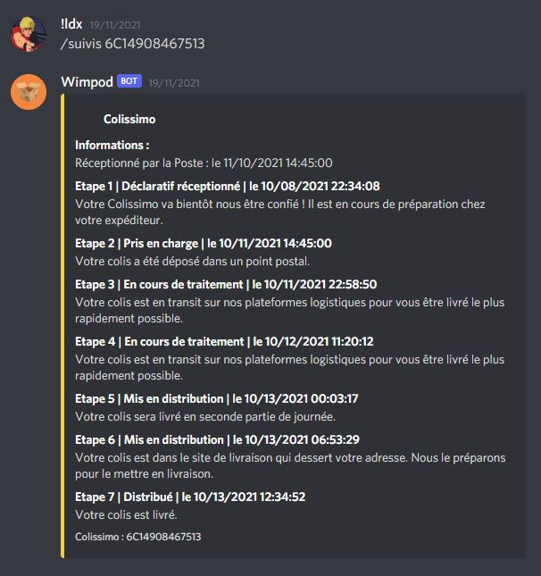

# Wimpod - Suivis de colis La Poste

## Le bot de suvis de colis La Poste sur Discord

Wimpod est un Bot de suivi de colis disponible sur Discord. Il vous permet de récupérer le suivi complet de votre colis dans votre messagerie préférée. Il utilise l'API officiel de La Poste et ne stock aucune donnée personnelle.

Voici un exemple de conversation avec le bot :

Le bot n'est malheureusement plus hébergé de mon côté, cependant s'il intéresse du monde je pourrais le relancer sur demande. Envoyer moi un DM sur Discord (!ldx#0696).

## Fontionnement

Le bot est développé en Python grâce aux librairies *Discorde.py* et *requests* afin de communiquer avec l'API HTTP de La Poste. Lorsque l'utilisateur effectue la commande */suivis numéro de suivis*, le bot effectue une requête HTTP à l'API de La Poste afin de récupérer en JSON les étapes de transport du colis et les mettres en forme pour les afficher. Le bot utilise notamment la [class Python de suivi de colis](https://github.com/ldxdev/la-poste-tracker) disponible dans son repositorie.

Pour information, l'API de La Poste pour le suivis de colis est disponible gratuitement sur demande d'une clé OKAPI sur le [site de La Poste](https://developer.laposte.fr).

## Liens utiles

- [API officiel de La Poste](https://developer.laposte.fr)
- [Documentation de l'API de suivis de colis](https://developer.laposte.fr/products/suivi/2/documentation)
- [Documentation Discord.py](https://discordpy.readthedocs.io/en/stable/)
